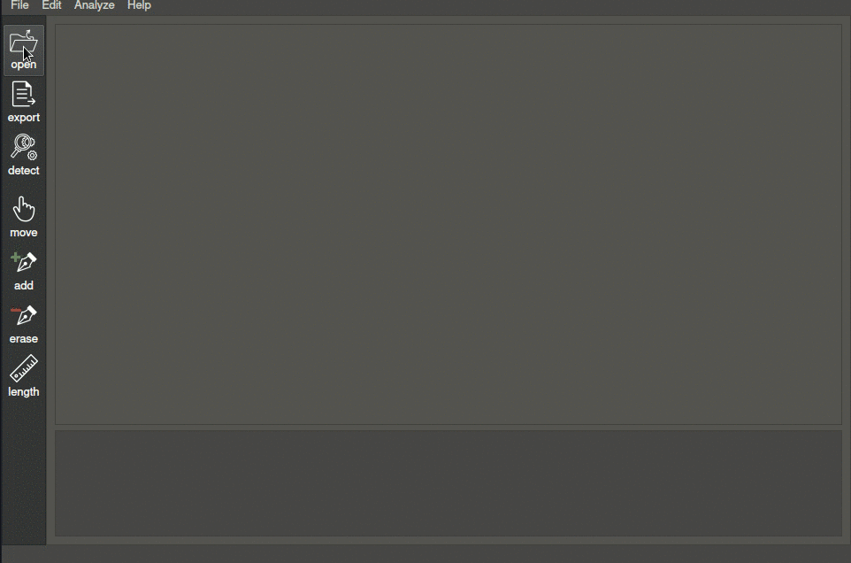
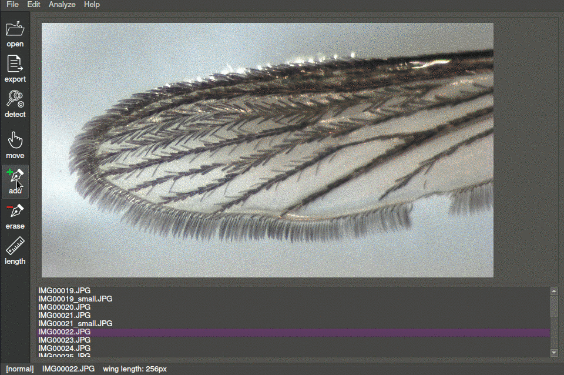
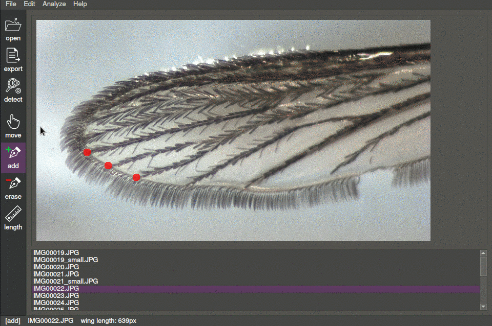
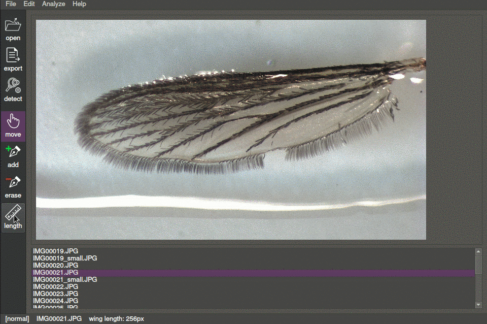
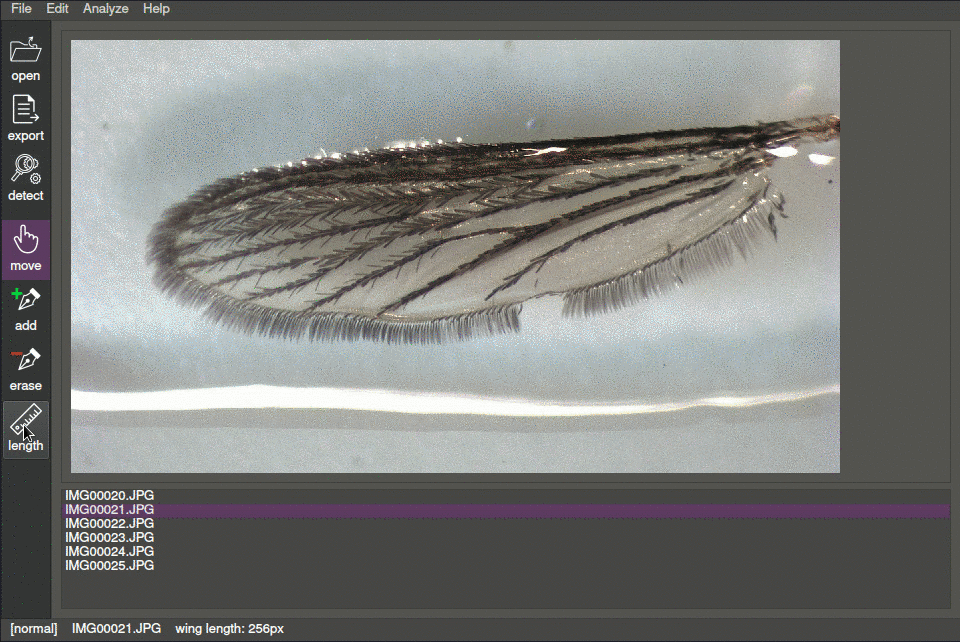
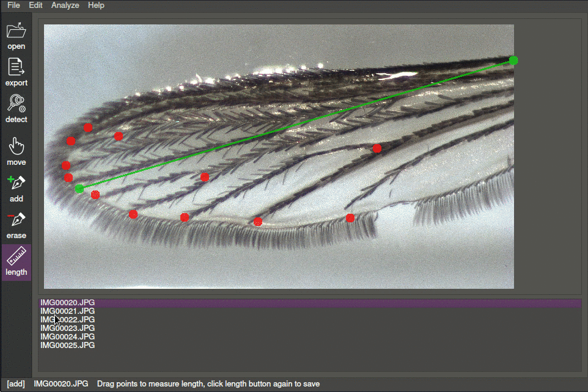
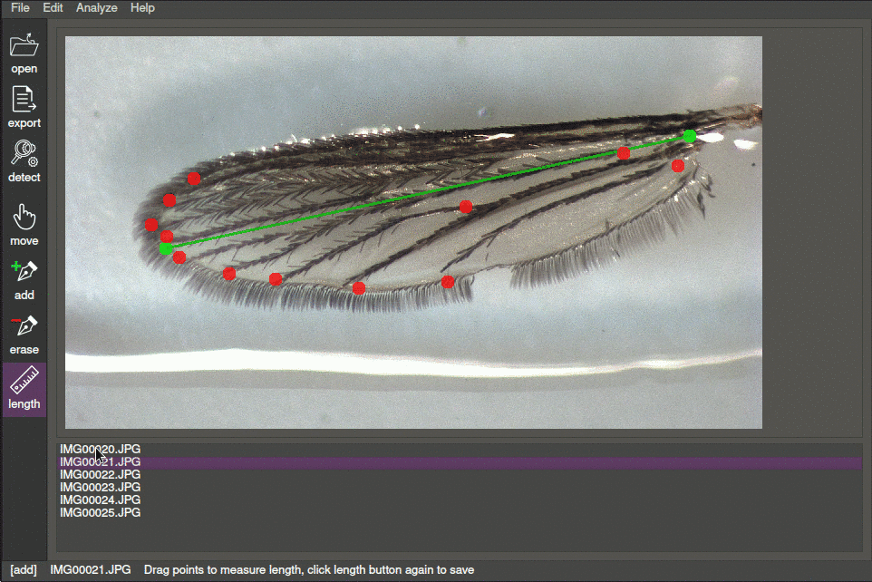

# Welcome to the [wingqt](https://github.com/wing-net/wingqt) documentation!

This page serves to document the software and its uses, as well as helping troubleshoot or answer frequently asked questions.

## Contents
* [About Wingqt](#about)
* [Installation](#installation)
* [Getting Started](#gettingstarted)
    * [Features](#features)
    * [Opening Images](#opening)
    * [Annotation Tools](#annotation)
    * [Exporting Data](#exporting)
* [Taking Compatible Images](#images)
* [Development](#development)
* [Troubleshooting](#troubleshooting)


## <a id="about"></a>About Wingqt
Wingqt is a project developed by [Nathan Baney](https://github.com/nathanbaney/), [Monica Perez](https://github.com/mon2154256/), [Michael Li](https://github.com/saesus/), [Dekart Kosa](https://github.com/Dekart97/) and [Scott Foster](https://github.com/sgfost/) for the Paaijmans Lab at Arizona State University in the Fall of 2020. It was created for semi-automatic morphological analysis of mosquito wings. The software features both automatic and manual tools for annotation of landmarks and length measurement of wings, wrapped in a user friendly graphical interface.


## <a id="installation"></a>Installation

The easiest way to get started with wingqt is to install an executable for your system found on the [releases page](https://github.com/wing-net/wingqt/releases). Simply extract the archive and run the executable (`wingqt.exe` for windows, or `wingqt` for MacOS and linux). You can move the wignqt folder anywhere, but be sure to not remove the executable from this folder (it is recommened to make a shortcut for it).

If you are concerned about running executables or would like to run it straight from the source, you can do so very easily since wingqt is written in 100% python. 

**Requirements:**
* Python 3.8+
* opencv-python, imutils, pyqt5

First, clone the repository

```git clone https://github.com/wing-net/wingqt.git```

Make sure you are using a correct python version have all of the required dependencies

```python --version```

**IMPORTANT** if you are a using windows there is a bug in later numpy releases so make sure to install the version below, users on MacOS or Linux need not worry

```pip3 install numpy==1.19.3```

```pip3 install pyqt opencv-python imutils```

With everything installed now, you should be able to run the program

```cd wingqt```

```python3 wingqt.py```


## <a id="gettingstarted"></a>Getting Started

### <a id="Features"></a>Features

The intended workflow for the program is annotating sets of mosquito wings in a folder with manual landmark annotation and automatic (or manual) length detection and exporting to individual comma-separated files for further use. The following features are in order of a typical use-case. Some additional "under-the-hood" features exist also, such as session state saving so that you can come back to previously annotated images in a set.

### <a id="opening"></a>Opening Images

First, to open a set of images, navigate to the containing folder and select any of the images. Every image in that set/folder will be loaded and you can navigate between then with the file list at the bottom.



### <a id="annotation"></a>Annotation Tools

Annotation tools can be selected from the action bar on the left, similar to common image manipulation programs like photoshop and GIMP. Once a tool is selected it will appear highlighted on the action bar and you can use the tool on the current image in the main canvas.

### Add Tool
To add landmarks, select the add tool and click on the landmark on the image.



### Move Tool
To move existing landmark points, select the move tool then click and drag a point to the desired location.



### Erase Tool
Similarly, existing points can be erased by selecting the erase tool and clicking on the point to remove.


### Length Tool
By default, the length dimension line is hidden, however this can be toggled on by selecting the length button in the action bar, clicking the length button again will hide the dimension line.



### Length Detection Tool
To automatically detect the length of a wing, press the detect button on the action bar, this may take a second or two depending on the resolution of the image. The stored length, visible on the status bar and the dimension line will be updated.



### <a id="exporting"></a>Exporting Data
Wingqt is able to export annotated length and landmark data in a plain-text, comma-separated format. Length and coordinates are in pixels relative to the original resolution of the image. The format looks like the following:

```
wing length: 896
12,324
233,22
492,109
292,582
583,201
288,902
```

You can either export data for a single images, or for every image in the current set.

For exporting a single image's annotations, press the export button on the action bar and choose a name and location to save the CSV file in.



To export all images' annotations, press File -> Export-all located in the menu bar. This will create .csv files in the same directory as the image set, with corresponding filenames (IMG01.jpg will export to IMG01.csv)




## <a id="images"></a>Taking Compatible Images
<add image guidelines here>


## <a id="development"></a>Development
<notes about implementations etc>


